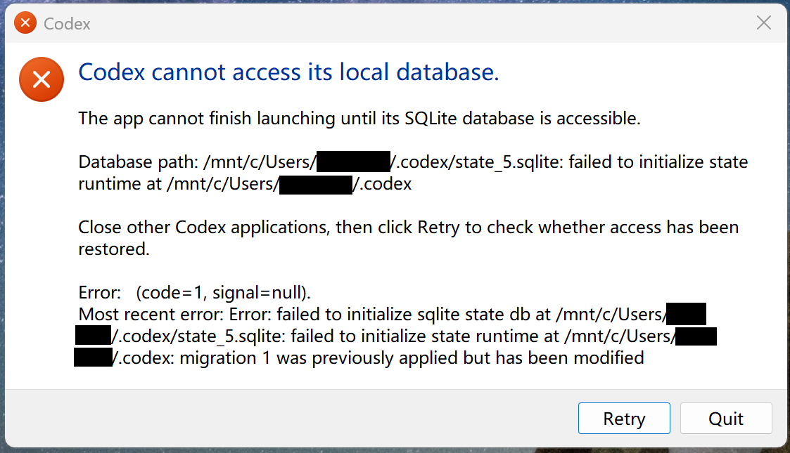

# Codex Repair Toolkit

[](LICENSE)
[](https://www.python.org/)
[](https://github.com/openai/codex/issues/23787)
[](https://github.com/openai/codex/issues/23777)

> Maintained by [**@xdifu**](https://github.com/xdifu). Issues + PRs welcome.

**Fix the "Codex cannot access its local database" crash on Codex Desktop after the `0.130 → 0.131` auto-update — without losing any conversations.**

If you just updated Codex Desktop on **Windows** (or macOS / Linux) and now see one of these dialogs:



> **Codex cannot access its local database.**
> The app cannot finish launching until its SQLite database is accessible.
>
> Database path: `/mnt/c/Users/<you>/.codex/state_5.sqlite`: failed to initialize state runtime at `/mnt/c/Users/<you>/.codex`
>
> Most recent error: `Error: failed to initialize sqlite state db at /mnt/c/Users/<you>/.codex/state_5.sqlite: failed to initialize state runtime at /mnt/c/Users/<you>/.codex:` **`migration 1 was previously applied but has been modified`**

or, after the first symptom is patched, this one:

> **An error has occurred**
> Codex crashed with the following error:
> `(code=1, signal=null).`
> Most recent error: `Error: failed to initialize sqlite state db at /mnt/c/Users/<you>/.codex/state_5.sqlite:` **`timed out waiting for state db backfill at /mnt/c/Users/<you>/.codex after 30s (status: running)`**

…**you are in the right place.** Both errors are **OpenAI's bug, not your computer's** (tracked upstream as [`openai/codex#23787`](https://github.com/openai/codex/issues/23787) and [`#23777`](https://github.com/openai/codex/issues/23777)). This toolkit fixes them **non-destructively, with full DB backups, SQLite schema verification, and dry-run by default**. Your conversation history (`~/.codex/sessions/*.jsonl`) is **never** touched.

## tl;dr

On Windows, run this from PowerShell or Windows Terminal:

```powershell
# 1. Clone this repo and cd into it.
git clone https://github.com/xdifu/codex-repair.git
cd codex-repair

# 2. Diagnose only — read-only, safe to run even with Codex App still open:
.\repair.ps1 -Mode doctor

# 3. Apply the fix — offers to stop Codex first, backs up DBs, schema-verifies before any write:
.\repair.ps1 -Mode fix -Apply
```

If you prefer to call the Python script directly, keep the target Codex home explicit:

```bash
# Native macOS / Linux Codex home:
python3 codex-repair.py doctor
python3 codex-repair.py fix --apply

# WSL bash repairing Windows Store Codex Desktop data:
python3 codex-repair.py doctor --codex-home "/mnt/c/Users/<WindowsUser>/.codex"
python3 codex-repair.py fix --apply --codex-home "/mnt/c/Users/<WindowsUser>/.codex"

# Useful read-only helpers:
python3 codex-repair.py doctor --use-isolated-copy
python3 codex-repair.py extract-checksums --json
python3 codex-repair.py -h
```

Typical full repair: under 5 minutes start-to-finish, including DB backups.

## Symptoms covered (verbatim error text for search engines)

If you searched for any of the following and landed here, this toolkit fixes it:

- `Codex cannot access its local database`
- `failed to initialize sqlite state db at /mnt/c/Users/<you>/.codex/state_5.sqlite`
- `failed to initialize state runtime at /mnt/c/Users/<you>/.codex`
- `migration 1 was previously applied but has been modified`
- `migration 2 was previously applied but has been modified` (logs_2.sqlite)
- `migration N was previously applied but has been modified` (any N from 1 to 32)
- `timed out waiting for state db backfill at /mnt/c/Users/<you>/.codex after 30s (status: running)`
- `Codex crashed with the following error: (code=1, signal=null)`
- `An error has occurred` dialog on Codex Desktop startup after auto-update
- `Repair Codex local data now? [y/N]` prompt (do **not** accept it — it wipes thread metadata)
- Codex Desktop sidebar suddenly empty after `0.130 → 0.131` update (related family — see [#17304](https://github.com/openai/codex/issues/17304), [#17540](https://github.com/openai/codex/issues/17540), [#18364](https://github.com/openai/codex/issues/18364), [#20608](https://github.com/openai/codex/issues/20608))

## Root cause

Two distinct bugs fire in sequence after a Codex Desktop `0.130.x → 0.131.x` update:

### Bug A — `sqlx` migration checksum drift (CRLF vs LF line endings)

First identified by [@MisterRound in `openai/codex#23777`](https://github.com/openai/codex/issues/23777) and independently corroborated in [`#23787`](https://github.com/openai/codex/issues/23787): the migration SQL bytes are identical at the source level, but:

- **`0.130` on Windows** ran the **Windows-native** Codex backend, whose `include_str!`-embedded migration files had **CRLF** line endings (a side effect of the Windows checkout / build pipeline). The SHA-384 written into `_sqlx_migrations.checksum` was therefore `sha384(CRLF(SQL))`.
- **`0.131` on Windows** switched the Codex Desktop GUI to launching the **WSL/Linux** backend ELF (`%USERPROFILE%\.codex\bin\wsl\<hash>\codex`), whose embedded migration files have **LF** line endings. The binary now expects `sha384(LF(SQL))`.

`sqlx` hashes embedded SQL **byte-for-byte** with SHA-384, so identical SQL text with different line endings produces different checksums. The migrator then refuses to open any DB whose recorded checksum doesn't match — even though the resulting `CREATE TABLE` schema is **fully forward-compatible** (this toolkit verifies that explicitly before touching anything).

In our 0.131.0-alpha.9 backend, affected migrations are typically rows `1..31` of `state_5.sqlite._sqlx_migrations` and/or rows `1..2` of `logs_2.sqlite._sqlx_migrations`, depending on which DB was last touched by which platform's binary.

### Bug B — 30-second GUI backfill timeout

After Bug A is patched, the Codex Desktop GUI imposes a hard-coded **30 s** wait for `state_5.sqlite.backfill_state.status='complete'`, even though the backend's own backfill lease is **900 s** (introduced by [PR #11377](https://github.com/openai/codex/pull/11377)). On any install with hundreds of MB of session history — particularly Windows installs where the backend reads `sessions/*.jsonl` via WSL's 9P protocol over `/mnt/c/` (5–10× slower than native APFS/ext4) — the GUI gives up while the backend is still making progress.

Full technical archeology in [`docs/root-cause-analysis.md`](docs/root-cause-analysis.md).

## Quick start

On Windows, run these from PowerShell or Windows Terminal:

```powershell
# Interactive diagnose + repair (recommended; prompts before each step):
.\repair.ps1

# Just diagnose, never touch the DB:
.\repair.ps1 -Mode doctor

# Zero-risk dry-run against a temp copy of the DBs (safe to run while Codex is open):
.\repair.ps1 -Mode fix -Isolated

# Apply the fix (will offer to stop Codex first):
.\repair.ps1 -Mode fix -Apply
```

## Directory layout

```
codex-repair\
├── codex-repair.py     ← core Python repair script
├── repair.ps1          ← Windows-friendly wrapper (recommended on Windows)
├── README.md           ← this file
├── docs\
│   ├── root-cause-analysis.md    ← deep technical writeup
│   └── upstream-bug-report.md    ← ready-to-paste GitHub issue / PR description
└── archive\            ← original 22 ad-hoc scripts from the 2026-05-21 incident
                          (kept for historical reference; NOT for re-use)
```

## What `codex-repair.py` does

### Subcommands

| Subcommand | What it does | Mutates DB? |
|------------|--------------|-------------|
| `doctor`   | Read-only diagnosis: locates the backend binary, scans it for embedded migration checksums, compares against each DB's `_sqlx_migrations`, and checks `backfill_state` + unindexed jsonl files. Reports a status code. | No |
| `fix`      | Run `doctor` first; based on what it finds, calls `fix-checksums` and/or `manual-backfill`. Default is dry-run; pass `--apply` to actually mutate. | Only with `--apply` |
| `fix-checksums` | For each DB migration whose stored checksum doesn't match the binary's hash of the same migration's SQL, **verify the actual table schema is already at the post-migration state**, then rewrite the stored checksum. Will refuse to touch a row whose schema is NOT compatible. | Only with `--apply` |
| `manual-backfill` | Discover sessions `jsonl` files that aren't yet in `threads`, insert thread metadata for each (dynamically against the current schema), and mark `backfill_state.status='complete'`. | Only with `--apply` |
| `extract-checksums` | Dump every expected migration checksum found in the backend binary. Useful for debugging or sharing in a GitHub issue. | No |

### Global flags

| Flag | Meaning |
|------|---------|
| `--codex-home PATH` | Codex home dir. Default is the `USERPROFILE` environment variable plus `.codex` when set, otherwise `~/.codex`. If running in WSL to repair Windows Store Codex Desktop data, pass `/mnt/c/Users/<WindowsUser>/.codex` explicitly. |
| `--binary PATH`     | Backend binary. Default: auto-detect newest in `{codex-home}\bin\wsl\*\codex` (falls back to `bin\codex.exe`). |
| `--apply`           | Actually mutate the DB. Without this, every subcommand runs dry-run. |
| `--use-isolated-copy` | Copy the DBs to a temp dir, then operate on copies. The live DB is never opened. Implies dry-run. **Recommended whenever Codex is running.** |
| `-v` / `--verbose`  | More output, including the binary scan region and anchor count. |

### Exit codes from `doctor`

| Code | Meaning |
|------|---------|
| `0`  | Healthy — no action needed. |
| `10` | Migration checksum drift detected. |
| `11` | Backfill stuck (unindexed files or `status != complete`). |
| `12` | Both. |
| `20` | Backend binary not found. |
| `21` | A required database file is missing. |
| `30` | User aborted. |
| `1`  | Other error. |

If WSL prints `CODEX_HOME = /home/<you>/.codex` and then `no backend binary found`, it is looking at the WSL Codex home, not the Windows Store Codex Desktop home. Use `repair.ps1` from PowerShell, or pass `--codex-home "/mnt/c/Users/<WindowsUser>/.codex"` explicitly.

## Safety guarantees

1. **Default is dry-run.** Every subcommand prints what it WOULD change. Only `--apply` actually mutates.
2. **Backup before mutate.** Every write is preceded by a timestamped backup of the affected DB (and its `-wal` / `-shm` siblings) named like `state_5.sqlite.bak-fix-checksums-<timestamp>`.
3. **Schema verification.** `fix-checksums` only rewrites a checksum after confirming the actual SQLite schema already contains every column the new migration SQL expects. If the schema is older than the binary expects, it refuses and tells you to manually investigate (because the migration body really needs to run, not just have its checksum patched).
4. **Atomic transactions.** Every mutation is wrapped in `BEGIN IMMEDIATE … COMMIT` and rolled back on any error.
5. **Idempotent.** Running `fix --apply` twice in a row is a no-op the second time.
6. **`--use-isolated-copy`.** When passed, the script copies the DBs to a private temp directory and operates only on those. Your real DB is never touched, even read-only. Useful for testing while Codex is running.
7. **Conversation data is never touched.** This toolkit only reads/writes `state_5.sqlite` and `logs_2.sqlite` (metadata / indexing DBs). Your actual chat history under `~/.codex/sessions/*.jsonl` is read-only the entire time.

## When to use this

- After a Codex Desktop auto-update, you see one of these errors:
  - `Codex cannot access its local database` / `migration N was previously applied but has been modified`
  - `timed out waiting for state db backfill at ... after 30s (status: running)`
- You want to verify your `.codex\` state is healthy after an upgrade.
- You want to dump the backend's expected checksums for comparison with a friend's install or a GitHub bug report.

## When NOT to use this

- If the error is something **other** than the two listed above (e.g., file permission errors, corrupted jsonl, `state_5.sqlite` truly corrupt per `PRAGMA integrity_check`). This tool will not help — it only handles the sqlx-migration-drift + backfill-timeout classes. For genuine corruption see upstream [#21750](https://github.com/openai/codex/issues/21750).
- If `.codex\sessions\` itself is missing or empty. This tool reconstructs **metadata** from sessions; it cannot recreate session content.

## Related upstream issues

The bug being repaired here is **OpenAI's**, not your computer's. Public tracking:

- [**#23787**](https://github.com/openai/codex/issues/23787) — `Codex App crashes after 0.130 → 0.131 auto-update: logs_2.sqlite migrations modified in place (sqlx checksum drift) + 30s GUI backfill cap incompatible with 900s backend lease` (**this toolkit's primary upstream issue**; covers both Bug A and Bug B with full evidence + proposed fixes)
- [**#23777**](https://github.com/openai/codex/issues/23777) — `Windows Desktop WSL app-server fails to launch due to CRLF/LF SQLx migration checksum mismatch` (sibling issue; first to identify the CRLF/LF root cause for Bug A — credit [@MisterRound](https://github.com/MisterRound))
- [#23251](https://github.com/openai/codex/issues/23251) — `WSL CLI cannot share Windows Codex App CODEX_HOME: migration 1 was previously applied but has been modified` (open; earlier subset of the same root cause filed by [@xdifu](https://github.com/xdifu))
- [#17304](https://github.com/openai/codex/issues/17304) — `Desktop project sidebar hides active threads after state DB migration drift` (open; downstream symptom on Mac)
- [#18364](https://github.com/openai/codex/issues/18364), [#20608](https://github.com/openai/codex/issues/20608) — Mac-side observations of the same migration-drift family
- [#17540](https://github.com/openai/codex/issues/17540), [#19873](https://github.com/openai/codex/issues/19873) — Windows sidebar disappearance after update
- [#21750](https://github.com/openai/codex/issues/21750) — adjacent: corrupt `state_5.sqlite` from forced shutdowns (not what this toolkit handles)
- [#16924](https://github.com/openai/codex/pull/16924) — `fix(sqlite): don't hard fail migrator if DB is newer` (merged; fixes the **opposite** direction)
- [#11377](https://github.com/openai/codex/pull/11377) — `feat: prevent double backfill` (introduced the 900 s backend lease that makes the 30 s GUI cap so glaringly inconsistent)
- [`docs/upstream-bug-report.md`](docs/upstream-bug-report.md) — paste-ready issue body / PR description for filing further reports.

## Requirements

- Codex Desktop on Windows 10/11 (with WSL2 backend), macOS, or Linux
- Python 3.10 or newer on PATH
- The `sqlite3` module (bundled with stock Python)

No third-party Python packages are required.

## Authorship & history

Distilled from a ~5-hour live diagnostic session on 2026-05-21 in which a Codex
Desktop update from `0.130.0-alpha.5` to `0.131.0-alpha.9` triggered both bugs
above. The original 22 ad-hoc scripts that uncovered the root cause are
preserved under [`archive/`](archive/) for posterity. See
[`docs/root-cause-analysis.md`](docs/root-cause-analysis.md) for the full story.
